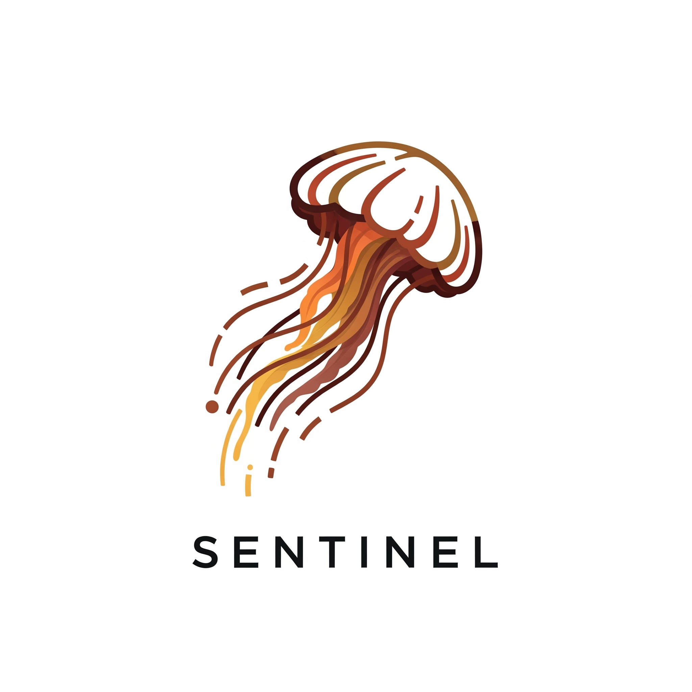

{ width="200" }

## Project Overview

`agent-cli` is a command-line interface (CLI) for interacting with and orchestrating intelligent agents powered by Google's Gemini Large Language Model. The goal of this project is to create a flexible, extensible framework for building AI-driven workflows, focusing on advanced agent capabilities like enhanced memory, context management inspired by mnemonic techniques, and efficient inference handling, while providing a cost-effective alternative to commercial vector database services for personal projects and shareable solutions.

## Features

This project is under active development. Below is a breakdown of current and planned functionalities.

### Phase 1: Foundation (Implemented)

* **CLI Structure:** Basic command-line interface using Cobra.
* **Gemini API Integration:** Seamless interaction with the `gemini-2.0-flash` model for LLM inference.
* **Basic Agent Definition:** A foundational `SimpleAgent` capable of processing messages.
* **Basic Conversation Flow:** Initial support for single-turn interactions.
* **API Key Management:** Securely loads Gemini API key from environment variables.
* **Error Handling & Logging:** Basic mechanisms for reporting errors and logging activities.

### Phase 2: Enhanced Agent Memory and Scalability Foundation (Currently In Progress)

* **Enhanced Memory System (AI Memory Palace Concept):**
    * **Response Caching:** Agents can cache user queries and their corresponding LLM responses, providing a richer short-term memory.
    * **Context Window Recall:** The agent explicitly retrieves recent conversation turns (cached responses) during its "walks through" memory to build the LLM's context.
* **Basic Knowledge Base (Simulated Embedding Spaces):**
    * **Topic-Based Knowledge Storage:** Allows adding text chunks under specific "topics," simulating distinct embedding spaces or domains of knowledge.
    * **Simulated Context Retrieval:** The agent can "walk through" and retrieve relevant knowledge snippets from the knowledge base based on the current query (currently via simple keyword matching).
    * **CLI Knowledge Management:** Commands (`knowledge add`, `knowledge list`) to manage the in-memory knowledge base.
* **In-Memory Inference Queue (Pub/Sub Placeholder):**
    * **Asynchronous Inference:** Uses Go channels to create a basic producer-consumer pattern for LLM inference requests, separating task submission from execution.
    * **Worker Pool:** Manages a configurable number of concurrent workers to process inference tasks.
* **Advanced Agent Prompt Engineering:** The agent's LLM prompt is engineered to effectively leverage both retrieved memory (cached responses) and knowledge base context.

### Phase 3: Agent Tooling & Advanced Orchestration (Planned)

* **External Tool Integration:** Define and execute external tools (e.g., web search, calculator, custom APIs) for agents to use.
* **Sophisticated Conversation History:** Implement more granular control and retrieval methods for conversation memory.
* **Multiple Agent Types:** Support for defining and managing different types of agents with specialized roles and capabilities.
* **Agent Orchestration Patterns:** Implement logic for chaining agents, branching dialogues, and multi-agent collaboration.
* **External Configuration:** Allow defining agents, tools, and orchestration flows via external files (e.g., YAML, JSON).

### Phase 4: Persistence, Scalability, and Distribution (Planned)

* **Persistent Storage:** Implement persistent storage for agent memory and the knowledge base (e.g., using SQLite for local persistence, or Firestore for cloud-native persistence).
* **Robust Message Broker Integration:** Replace the in-memory inference queue with a more robust message broker (e.g., Redis Pub/Sub, RabbitMQ, NATS) for distributed load balancing and resilience.
* **CLI Distribution:** Package the CLI for easy installation and distribution (e.g., via Homebrew, pre-compiled binaries).
* **Comprehensive Documentation:** Detailed user and developer documentation.
* **Performance Optimization & Testing:** Rigorous testing, benchmarking, and optimization for production readiness.

## Installation

### Prerequisites

* **Go:** Ensure you have Go (version 1.18 or higher recommended) installed on your system. You can download it from [golang.org/dl](https://golang.org/dl/).

### Setup

1.  **Clone the Repository:**
    ```bash
    git clone [https://github.com/your-username/agent-cli.git](https://github.com/your-username/agent-cli.git) # Replace with your repo URL
    cd agent-cli
    ```
2.  **Initialize Go Module and Install Dependencies:**
    ```bash
    go mod tidy
    ```
    This command will download and install the necessary Go modules, including `github.com/spf13/cobra`.
3.  **Set Your Gemini API Key:**
    The CLI requires your Google Gemini API key to interact with the LLM. Set it as an environment variable:

    * **Linux/macOS:**
        ```bash
        export GEMINI_API_KEY="YOUR_GEMINI_API_KEY"
        ```
    * **Windows (Command Prompt):**
        ```cmd
        set GEMINI_API_KEY="YOUR_GEMINI_API_KEY"
        ```
    * **Windows (PowerShell):
        ```powershell
        $env:GEMINI_API_KEY="YOUR_GEMINI_API_KEY"
        ```
    Replace `"YOUR_GEMINI_API_KEY"` with your actual key obtained from the Google AI Studio.

## Usage

### Basic Chat with Memory & Context

To start a chat session with the default agent:

```bash
go run . chat
